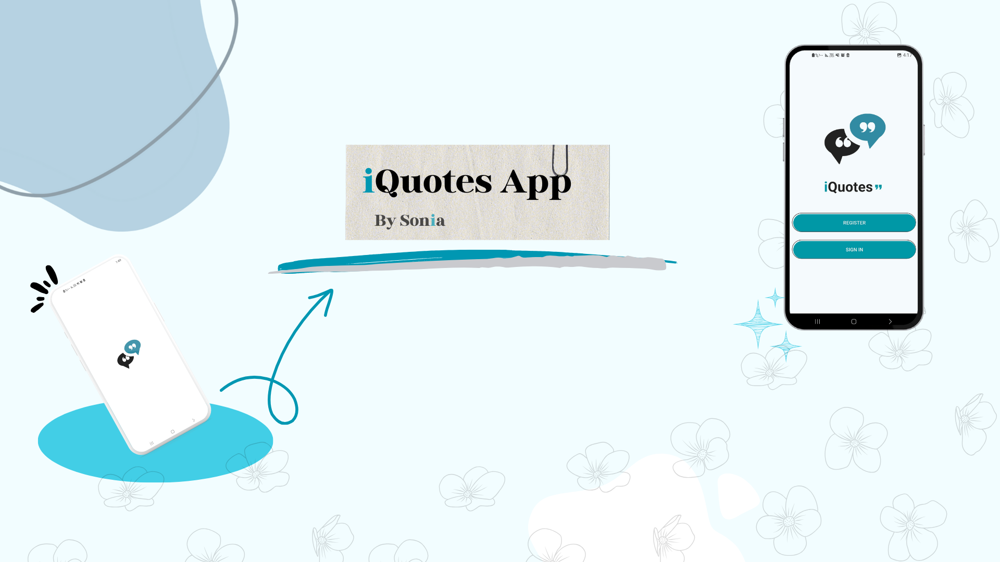
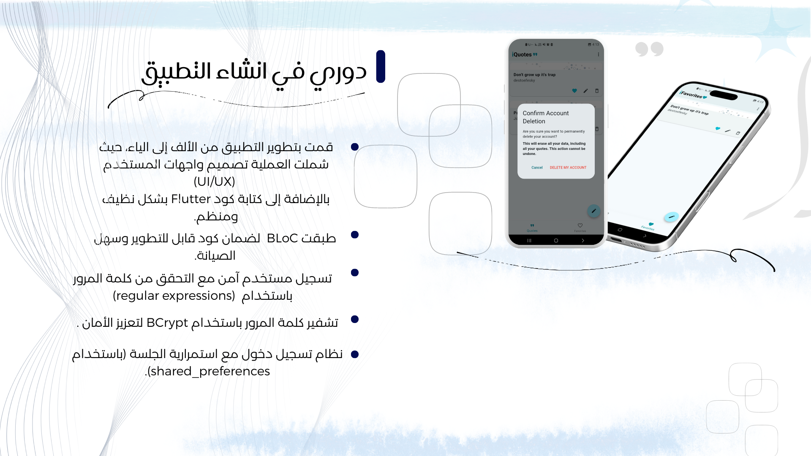
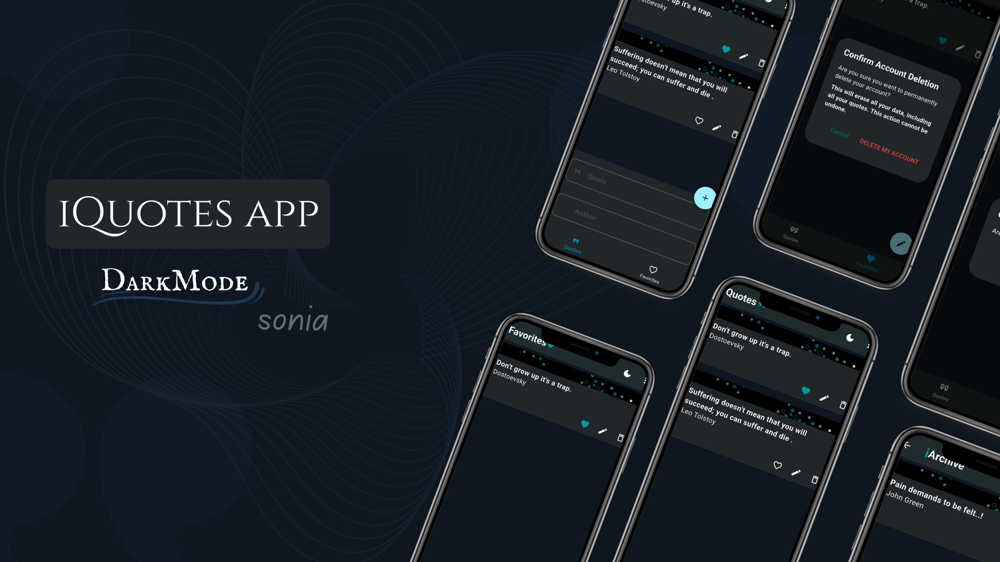
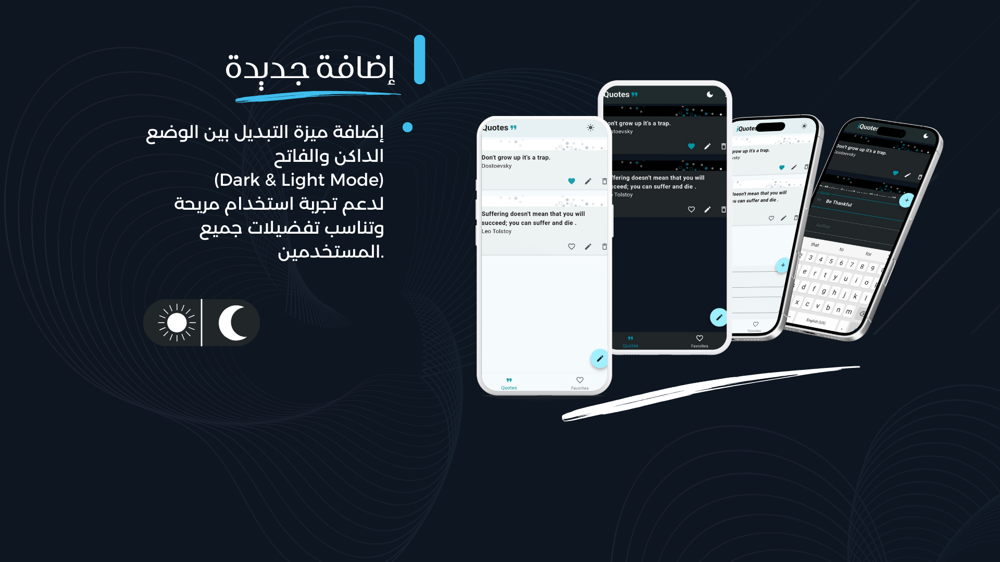

# iQuotes 📖✨

iQuotes is a personal quotes manager app that lets users securely save, organize, and revisit their favorite quotes — with authentication, password hashing, and local database storage for maximum privacy.


---

## 🚀 Features

- **User Authentication**
  - Secure user registration with password validation (regular expressions).
  - Password hashing using **BCrypt** for enhanced security.
  - Login system with session persistence (`shared_preferences`).

- **Quote Management**
  - Save quotes with author names.
  - Input validation → cannot add empty quotes or author names.
  - Mark quotes as *Favorites* for quick access.
  - Archive/unarchive quotes for better organization.

- **Local Data Storage**
  - All user data and quotes are stored privately on-device using SQLite.

- **State Management**
  - Clean and predictable state management using **Bloc/Cubit**.


- **🌙 Dark Mode support**.
- A feature has been added to toggle between Light mode and Dark mode for the application interface, taking into account color contrast and eye comfort. Users can manually choose their preferred mode.

---

## 🛠️ Tech Stack & Key Packages
- **Flutter & Dart** – core framework.
- **State Management** – `flutter_bloc`
- **Database** – `sqflite`
- **Secure Password Hashing** – `bcrypt`
- **Persistence** – `shared_preferences`
- **Form Validation** – Flutter Forms + Regex

---

## 📱 Screenshots

| Screen        | Image |
|---------------|-------|
| Welcome       |  |
| Quotes Layout |  |
| Quotes List   |  |
| Dark & Light mode toggle  |  |
| Dark & Light mode toggle |  |

---
## 📌 App Info

 - **App Name** : iQuotes

 - **BCrypt Package** : bcrypt: ^1.1.3
   
----

## 🔮 Future Improvements

📤 Share quotes easily with friends (using share_plus).

🎲 Quote of the Day: random quote generator from saved collection.

☁️ Optional cloud backup in the future.

---

## 🏁 Getting Started

```bash
git clone https://github.com/Sonialr7iny/iQuotes.git
cd iQuotes
flutter pub get
flutter run

---

